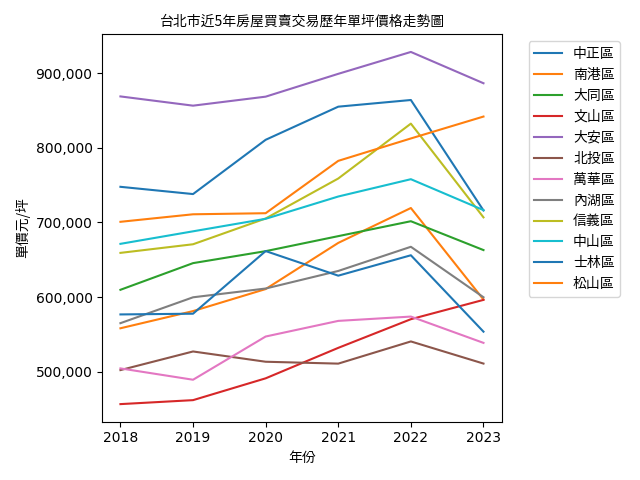

# tw_rent_roi_calculator

# 概要
從內政部地政司_不動產成交案件_實際資訊資料供應系統的Open Data中 (https://plvr.land.moi.gov.tw/Index) 爬取全國房地產數據，下載的數據包含不動產買賣、預售屋買賣、不動產租賃。透過不動產買賣的資料繪製出「近5年不動產買賣單坪價格走勢圖」，並利用不動產租賃資料可計算台灣各區域租金投資回報率

# 資料說明
1. 第1個字母代表縣市
2. 最後1個字母代表不動產資料類型

name|schema|description
-|-|-
a_lvr_land_a.csv|schema-main.csv|臺北市不動產買賣
a_lvr_land_b.csv|schema-main-sale.csv|臺北市預售屋買賣
a_lvr_land_c.csv|schema-main-rent.csv|臺北市不動產租賃

[所有資料說明表-manifest](https://docs.google.com/spreadsheets/d/1qSuhjntSfDnmu9lnagC09AbsrHQ8Q0qDM3eVSb07LVw/edit#gid=609529863)

# 使用方法
1. git clone此repo到您的本地電腦
2. 透過requirements.txt來安裝所需Python套件
3. 更改config.ini的相關設定
5. 執行main.py抓取不動產資料，並計算租金投資回報率

# 台北市2023年租金投資回報率
鄉鎮市區|2023年平均買賣價/坪|2023年平均租金/坪|2023年租金報酬率%
-|-|-|-
中山區|716498.4949|1620.635049|2.71
中正區|775327.9655|1363.142507|2.11
信義區|847692.3956|1365.975227|1.93
內湖區|599806.9453|1033.059375|2.07
北投區|511002.99|1195.44206|2.81
南港區|596753.9381|1302.245132|2.62
士林區|553734.4256|1244.542941|2.70
大同區|663004.4674|1589.658436|2.88
大安區|921905.8594|1744.326192|2.27
文山區|596301.706|927.2128767|1.87
松山區|954980.778|1435.44748|1.80
萬華區|538719.9531|1067.632429|2.38

[台灣各地區租金投資回報率](https://docs.google.com/spreadsheets/d/1qSuhjntSfDnmu9lnagC09AbsrHQ8Q0qDM3eVSb07LVw/edit#gid=609529863)

# 近5年台北市不動產買賣單坪價格走勢圖

[台北市不動產買賣單坪價格走勢圖-Tableau](https://public.tableau.com/views/taipei_real_estate_price/5?:language=zh-TW&publish=yes&:display_count=n&:origin=viz_share_link)
